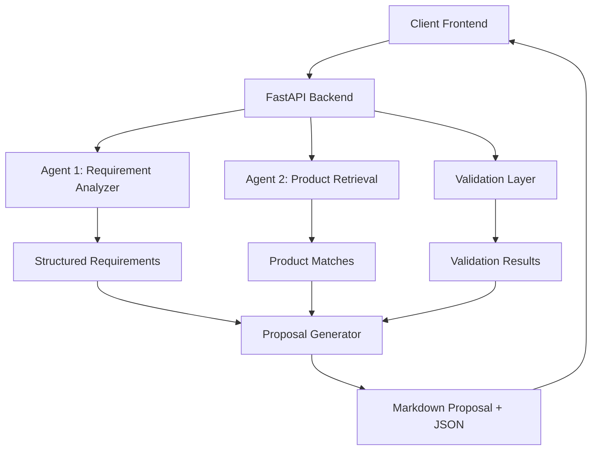
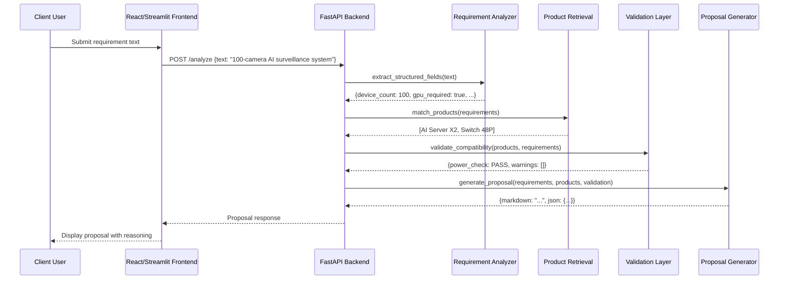

# Design Document: autose-platform

## Overview

The AutoSE (Autonomous Solution Engineering) Platform is a multi-agent autonomous system for enterprise solution engineering that validates compatibility, optimizes infrastructure decisions, and generates proposals automatically. The platform consists of a frontend chat-style interface, a backend API with specialized agents for requirement analysis and product retrieval, and a deterministic validation layer. The system processes client requirements through a pipeline of specialized agents to generate optimized infrastructure proposals with explainable reasoning.

## Architecture



## Sequence Diagrams

### Main Workflow Sequence



## Components and Interfaces

### Component 1: Frontend Interface

**Purpose**: Provides chat-style interface for client requirement input and proposal display

**Interface**:
```typescript
interface FrontendComponent {
  // User input handling
  submitRequirement(text: string): Promise<ProposalResponse>;
  
  // Display methods
  displayProposal(proposal: Proposal): void;
  displayError(error: string): void;
  
  // State management
  getInputHistory(): RequirementHistory[];
  clearHistory(): void;
}

interface ProposalResponse {
  markdown: string;
  json: ProposalJSON;
  timestamp: string;
}

interface ProposalJSON {
  requirements: StructuredRequirements;
  selected_products: Product[];
  validation_results: ValidationResult[];
  reasoning: Reasoning;
  optimization_suggestions: string[];
}
```

### Component 2: FastAPI Backend

**Purpose**: Orchestrates the multi-agent pipeline and serves API endpoints

**Interface**:
```python
class FastAPIBackend:
    """Main backend orchestrator for AutoSE platform"""
    
    def __init__(self):
        self.requirement_analyzer = RequirementAnalyzer()
        self.product_retriever = ProductRetriever()
        self.validator = ValidationLayer()
        self.proposal_generator = ProposalGenerator()
    
    async def analyze_requirement(self, text: str) -> Dict[str, Any]:
        """Process requirement through the full pipeline"""
        # 1. Extract structured requirements
        requirements = self.requirement_analyzer.extract(text)
        
        # 2. Retrieve matching products
        products = self.product_retriever.match(requirements)
        
        # 3. Validate compatibility
        validation = self.validator.validate(products, requirements)
        
        # 4. Generate proposal
        proposal = self.proposal_generator.generate(
            requirements, products, validation
        )
        
        return proposal
```

### Component 3: Requirement Analyzer Agent

**Purpose**: Extracts structured fields from natural language user input using LLM

**Interface**:
```python
class RequirementAnalyzer:
    """Agent 1: Extracts structured requirements from text"""
    
    def __init__(self, model: str = "DeepSeek V3.2"):
        self.model = model
        self.extraction_schema = {
            "device_count": "integer",
            "gpu_required": "boolean",
            "estimated_power_w": "integer",
            "network_ports": "integer"
        }
    
    def extract(self, text: str) -> StructuredRequirements:
        """Extract structured fields from natural language text"""
        # Use LLM to parse text according to schema
        # Returns StructuredRequirements object
        
    def validate_extraction(self, requirements: StructuredRequirements) -> bool:
        """Validate extracted requirements meet minimum criteria"""
```

### Component 4: Product Retrieval Agent

**Purpose**: Matches requirements against hardcoded product catalog

**Interface**:
```python
class ProductRetriever:
    """Agent 2: Retrieves matching products from catalog"""
    
    def __init__(self):
        self.catalog = self._load_catalog()
    
    def _load_catalog(self) -> List[Product]:
        """Load hardcoded product catalog"""
        return [
            Product(name="AI Server X1", power_w=800, gpu_count=4, 
                   price=15000, max_cameras=50),
            Product(name="AI Server X2", power_w=1500, gpu_count=8,
                   price=28000, max_cameras=120),
            Product(name="Edge Node", power_w=150, gpu_count=1,
                   price=4000, max_cameras=10),
            Product(name="UPS 5000W", power_w=5000, capacity_w=5000,
                   price=0, max_cameras=0),
            Product(name="Switch 48P", power_w=400, port_count=48,
                   price=0, max_cameras=0)
        ]
    
    def match(self, requirements: StructuredRequirements) -> List[Product]:
        """Match requirements against product catalog"""
        # Filter and rank products based on requirements
```

### Component 5: Validation Layer

**Purpose**: Deterministic validation of product compatibility (not LLM-based)

**Interface**:
```python
class ValidationLayer:
    """Deterministic validation of product compatibility"""
    
    def __init__(self, power_threshold_w: int = 5000):
        self.power_threshold = power_threshold_w
    
    def validate(self, products: List[Product], 
                 requirements: StructuredRequirements) -> ValidationResult:
        """Validate product compatibility with requirements"""
        # Check power consumption against UPS capacity
        # Check network port requirements
        # Check GPU requirements
        # Return validation results with warnings if any
```

### Component 6: Proposal Generator

**Purpose**: Generates markdown proposal with explainable reasoning

**Interface**:
```python
class ProposalGenerator:
    """Generates final proposal with reasoning"""
    
    def generate(self, requirements: StructuredRequirements,
                 products: List[Product],
                 validation: ValidationResult) -> Proposal:
        """Generate comprehensive proposal"""
        # Create markdown with:
        # 1. Why selected product is recommended
        # 2. Why alternatives were rejected
        # 3. Risk analysis (if any)
        # 4. Optimization suggestions
```

## Data Models

### Model 1: StructuredRequirements

```python
from pydantic import BaseModel, Field
from typing import Optional

class StructuredRequirements(BaseModel):
    """Extracted structured requirements from user input"""
    device_count: int = Field(..., ge=1, description="Number of devices/cameras")
    gpu_required: bool = Field(..., description="Whether GPU is required")
    estimated_power_w: int = Field(..., ge=0, description="Estimated power in watts")
    network_ports: int = Field(..., ge=0, description="Required network ports")
    
    class Config:
        schema_extra = {
            "example": {
                "device_count": 100,
                "gpu_required": True,
                "estimated_power_w": 1500,
                "network_ports": 48
            }
        }
```

### Model 2: Product

```python
class Product(BaseModel):
    """Product from the hardcoded catalog"""
    name: str
    power_w: int = Field(..., ge=0, description="Power consumption in watts")
    gpu_count: int = Field(0, ge=0, description="Number of GPUs")
    price: int = Field(..., ge=0, description="Price in USD")
    max_cameras: int = Field(0, ge=0, description="Maximum cameras supported")
    port_count: int = Field(0, ge=0, description="Number of network ports")
    capacity_w: int = Field(0, ge=0, description="Capacity in watts (for UPS)")
    
    def can_support_cameras(self, count: int) -> bool:
        """Check if product can support given number of cameras"""
        return self.max_cameras >= count if self.max_cameras > 0 else True
```

### Model 3: ValidationResult

```python
class ValidationResult(BaseModel):
    """Results from deterministic validation"""
    power_check: str = Field(..., description="PASS/FAIL/WARNING")
    power_warning: Optional[str] = None
    network_check: str = Field(..., description="PASS/FAIL/WARNING")
    gpu_check: str = Field(..., description="PASS/FAIL/WARNING")
    warnings: List[str] = Field(default_factory=list)
    
    def is_valid(self) -> bool:
        """Check if all validations passed"""
        return all([
            self.power_check == "PASS",
            self.network_check == "PASS",
            self.gpu_check == "PASS"
        ])
```

### Model 4: Proposal

```python
class Proposal(BaseModel):
    """Final proposal output"""
    markdown: str = Field(..., description="Markdown formatted proposal")
    json: Dict[str, Any] = Field(..., description="JSON reasoning structure")
    requirements: StructuredRequirements
    selected_products: List[Product]
    validation: ValidationResult
    timestamp: str = Field(default_factory=lambda: datetime.now().isoformat())
```

## Algorithmic Pseudocode

### Main Processing Algorithm

```pascal
ALGORITHM process_requirement_pipeline
INPUT: requirement_text of type String
OUTPUT: proposal of type Proposal

BEGIN
  ASSERT requirement_text ≠ "" AND requirement_text ≠ null
  
  // Step 1: Initialize components
  analyzer ← RequirementAnalyzer(model="DeepSeek V3.2")
  retriever ← ProductRetriever()
  validator ← ValidationLayer(power_threshold=5000)
  generator ← ProposalGenerator()
  
  // Step 2: Extract structured requirements
  requirements ← analyzer.extract(requirement_text)
  ASSERT requirements.device_count > 0
  
  // Step 3: Retrieve matching products with loop invariant
  all_products ← retriever.catalog
  matching_products ← []
  
  FOR each product IN all_products DO
    ASSERT product selection criteria remain consistent
    
    IF product.matches_requirements(requirements) THEN
      matching_products.add(product)
    END IF
  END FOR
  
  ASSERT matching_products ≠ [] OR requirements validation failed
  
  // Step 4: Validate compatibility
  validation ← validator.validate(matching_products, requirements)
  
  // Step 5: Generate proposal
  proposal ← generator.generate(requirements, matching_products, validation)
  
  ASSERT proposal.markdown ≠ "" AND proposal.json ≠ {}
  ASSERT proposal.validation.is_valid() OR proposal contains warnings
  
  RETURN proposal
END
```

**Preconditions:**
- requirement_text is non-empty string
- All component classes are properly initialized
- Product catalog is loaded and valid
- Validation thresholds are properly configured

**Postconditions:**
- Returns valid Proposal object
- Proposal contains both markdown and JSON formats
- Validation results are included in proposal
- If validation fails, proposal includes clear warnings

**Loop Invariants:**
- Product matching criteria remain consistent throughout iteration
- All previously selected products remain valid matches
- Requirements do not change during product matching loop

### Requirement Extraction Algorithm

```pascal
ALGORITHM extract_structured_requirements
INPUT: text of type String
OUTPUT: requirements of type StructuredRequirements

BEGIN
  // Initialize LLM with extraction schema
  extraction_prompt ← create_extraction_prompt(text)
  
  // Call DeepSeek V3.2 API
  llm_response ← call_llm_api(extraction_prompt, model="DeepSeek V3.2")
  
  // Parse structured response
  parsed_data ← parse_json_response(llm_response)
  
  // Validate and create requirements object
  requirements ← StructuredRequirements(
    device_count: parsed_data.device_count,
    gpu_required: parsed_data.gpu_required,
    estimated_power_w: parsed_data.estimated_power_w,
    network_ports: parsed_data.network_ports
  )
  
  // Validate extracted values
  ASSERT requirements.device_count > 0
  ASSERT requirements.estimated_power_w >= 0
  ASSERT requirements.network_ports >= 0
  
  RETURN requirements
END
```

**Preconditions:**
- text is non-empty string
- LLM API is accessible and properly configured
- Extraction schema is defined and valid

**Postconditions:**
- Returns valid StructuredRequirements object
- All fields are properly typed and validated
- If extraction fails, raises appropriate exception

### Product Matching Algorithm

```pascal
ALGORITHM match_products_to_requirements
INPUT: requirements of type StructuredRequirements
       catalog of type List[Product]
OUTPUT: matched_products of type List[Product]

BEGIN
  matched_products ← []
  
  // Filter products based on requirements
  FOR each product IN catalog DO
    matches ← true
    
    // Check camera support
    IF product.max_cameras > 0 THEN
      IF requirements.device_count > product.max_cameras THEN
        matches ← false
      END IF
    END IF
    
    // Check GPU requirement
    IF requirements.gpu_required AND product.gpu_count = 0 THEN
      matches ← false
    END IF
    
    // Check network ports
    IF requirements.network_ports > 0 AND product.port_count > 0 THEN
      IF requirements.network_ports > product.port_count THEN
        matches ← false
      END IF
    END IF
    
    IF matches THEN
      matched_products.add(product)
    END IF
  END FOR
  
  // Sort by relevance (camera capacity, then price)
  matched_products.sort_by(
    primary: product.max_cameras DESC,
    secondary: product.price ASC
  )
  
  RETURN matched_products
END
```

**Preconditions:**
- requirements is valid StructuredRequirements object
- catalog is non-empty list of Product objects
- All products have valid attributes

**Postconditions:**
- Returns list of matching products (may be empty)
- Products are sorted by relevance (camera capacity descending, price ascending)
- Only products that meet all requirements are included

**Loop Invariants:**
- Matching criteria remain consistent throughout iteration
- Product attributes do not change during matching
- Requirements do not change during matching

### Power Validation Algorithm

```pascal
ALGORITHM validate_power_compatibility
INPUT: products of type List[Product]
       requirements of type StructuredRequirements
       threshold of type Integer = 5000
OUTPUT: validation of type ValidationResult

BEGIN
  total_power ← 0
  has_ups ← false
  ups_capacity ← 0
  
  // Calculate total power consumption
  FOR each product IN products DO
    total_power ← total_power + product.power_w
    
    // Check for UPS in products
    IF product.name CONTAINS "UPS" THEN
      has_ups ← true
      ups_capacity ← product.capacity_w
    END IF
  END FOR
  
  // Create validation result
  validation ← ValidationResult()
  
  IF has_ups THEN
    IF total_power > ups_capacity THEN
      validation.power_check ← "FAIL"
      validation.power_warning ← "Total power exceeds UPS capacity"
    ELSE IF total_power > threshold THEN
      validation.power_check ← "WARNING"
      validation.power_warning ← "High power consumption near limit"
    ELSE
      validation.power_check ← "PASS"
    END IF
  ELSE
    IF total_power > threshold THEN
      validation.power_check ← "WARNING"
      validation.power_warning ← "No UPS selected, power exceeds safe limit"
    ELSE
      validation.power_check ← "PASS"
    END IF
  END IF
  
  RETURN validation
END
```

**Preconditions:**
- products is list of Product objects (may be empty)
- requirements is valid StructuredRequirements object
- threshold is positive integer

**Postconditions:**
- Returns ValidationResult with power check status
- Includes warning message if power exceeds limits
- Properly handles cases with and without UPS

**Loop Invariants:**
- Power calculation accumulates correctly
- UPS detection logic remains consistent
- Product power values do not change during calculation

## Key Functions with Formal Specifications

### Function 1: extract_structured_fields()

```python
def extract_structured_fields(text: str) -> StructuredRequirements:
    """
    Extract structured requirements from natural language text using LLM.
    
    Args:
        text: Natural language requirement description
        
    Returns:
        StructuredRequirements object with extracted fields
        
    Raises:
        ExtractionError: If LLM fails to extract valid structured data
        ValidationError: If extracted data fails validation
    """
```

**Preconditions:**
- `text` is non-empty string
- LLM API is accessible and properly configured
- Extraction schema is defined and matches StructuredRequirements model

**Postconditions:**
- Returns valid StructuredRequirements object
- All fields are properly typed and within valid ranges
- If extraction fails, raises ExtractionError with descriptive message
- If validation fails, raises ValidationError with specific field errors

**Loop Invariants:** N/A (no loops in this function)

### Function 2: match_products()

```python
def match_products(requirements: StructuredRequirements) -> List[Product]:
    """
    Match requirements against product catalog and return compatible products.
    
    Args:
        requirements: Structured requirements to match against
        
    Returns:
        List of Product objects sorted by relevance (camera capacity descending, price ascending)
        
    Raises:
        CatalogError: If product catalog cannot be loaded
    """
```

**Preconditions:**
- `requirements` is valid StructuredRequirements object
- Product catalog is loaded and contains valid Product objects
- All Product objects have required attributes defined

**Postconditions:**
- Returns list of Product objects (may be empty if no matches)
- Products are filtered to only those that meet all requirements
- List is sorted by camera capacity (descending) then price (ascending)
- If catalog cannot be loaded, raises CatalogError

**Loop Invariants:**
- For filtering loop: All previously checked products maintain their match status
- Matching criteria remain consistent throughout iteration
- Requirements do not change during matching process

### Function 3: validate_compatibility()

```python
def validate_compatibility(products: List[Product], 
                          requirements: StructuredRequirements) -> ValidationResult:
    """
    Perform deterministic validation of product compatibility with requirements.
    
    Args:
        products: List of selected products
        requirements: Original requirements for validation
        
    Returns:
        ValidationResult object with check statuses and warnings
    """
```

**Preconditions:**
- `products` is list of Product objects (may be empty)
- `requirements` is valid StructuredRequirements object
- Validation thresholds are properly configured (power_threshold=5000)

**Postconditions:**
- Returns ValidationResult with power_check, network_check, gpu_check statuses
- Includes warnings list if any validation issues found
- Power check: PASS/FAIL/WARNING based on total power vs UPS capacity
- Network check: PASS/FAIL based on port requirements
- GPU check: PASS/FAIL based on GPU requirements

**Loop Invariants:**
- For power calculation loop: Total power accumulates correctly
- Product attributes do not change during validation
- Validation logic remains consistent throughout checks

### Function 4: generate_proposal()

```python
def generate_proposal(requirements: StructuredRequirements,
                     products: List[Product],
                     validation: ValidationResult) -> Proposal:
    """
    Generate comprehensive proposal with explainable reasoning.
    
    Args:
        requirements: Original structured requirements
        products: Selected products
        validation: Validation results
        
    Returns:
        Proposal object with markdown and JSON formats
    """
```

**Preconditions:**
- `requirements` is valid StructuredRequirements object
- `products` is non-empty list of Product objects
- `validation` is valid ValidationResult object
- All required template data is available

**Postconditions:**
- Returns Proposal object with both markdown and JSON formats
- Markdown includes: product recommendations, reasoning, risk analysis, optimizations
- JSON includes: structured reasoning, alternatives analysis, validation details
- Proposal timestamp is set to current time
- If products list is empty, proposal indicates no suitable products found

## Example Usage

### Backend Python Example

```python
# Example 1: Complete pipeline execution
from autose_platform import FastAPIBackend

backend = FastAPIBackend()
requirement_text = "Deploy an AI security system supporting 100 cameras"

proposal = await backend.analyze_requirement(requirement_text)

print("Markdown Proposal:")
print(proposal.markdown)

print("\nJSON Reasoning:")
import json
print(json.dumps(proposal.json, indent=2))

# Example 2: Individual component usage
from autose_platform import RequirementAnalyzer, ProductRetriever

analyzer = RequirementAnalyzer()
retriever = ProductRetriever()

requirements = analyzer.extract("100-camera AI surveillance system")
print(f"Extracted: {requirements}")

products = retriever.match(requirements)
print(f"Matched products: {[p.name for p in products]}")

# Example 3: Validation check
from autose_platform import ValidationLayer

validator = ValidationLayer(power_threshold=5000)
validation = validator.validate(products, requirements)

if validation.is_valid():
    print("All validations passed!")
else:
    print(f"Validation warnings: {validation.warnings}")
```

### Frontend TypeScript Example

```typescript
// Example 1: Frontend component usage
import { FrontendComponent } from './autose-frontend';

const frontend = new FrontendComponent();

async function handleSubmit() {
  const requirementText = document.getElementById('requirement-input').value;
  
  try {
    const response = await frontend.submitRequirement(requirementText);
    
    // Display markdown proposal
    document.getElementById('proposal-output').innerHTML = 
      marked.parse(response.markdown);
    
    // Show JSON reasoning in debug panel
    console.log('JSON Reasoning:', response.json);
    
    // Update history
    const history = frontend.getInputHistory();
    updateHistoryUI(history);
    
  } catch (error) {
    frontend.displayError(error.message);
  }
}

// Example 2: Display proposal with formatting
function displayProposal(proposal: Proposal) {
  const container = document.getElementById('proposal-container');
  
  // Create markdown renderer
  const md = new markdownit();
  const html = md.render(proposal.markdown);
  
  container.innerHTML = html;
  
  // Add interactive elements
  if (proposal.validation.warnings.length > 0) {
    addWarningBanner(proposal.validation.warnings);
  }
  
  // Show optimization suggestions
  if (proposal.json.optimization_suggestions) {
    addSuggestionsPanel(proposal.json.optimization_suggestions);
  }
}

// Example 3: Error handling
function handleError(error: string) {
  const errorDiv = document.getElementById('error-message');
  errorDiv.textContent = `Error: ${error}`;
  errorDiv.style.display = 'block';
  
  // Auto-hide after 5 seconds
  setTimeout(() => {
    errorDiv.style.display = 'none';
  }, 5000);
}
```

### API Usage Example

```python
# FastAPI endpoint example
from fastapi import FastAPI, HTTPException
from pydantic import BaseModel

app = FastAPI()

class RequirementRequest(BaseModel):
    text: str

class ProposalResponse(BaseModel):
    markdown: str
    json: dict
    timestamp: str

@app.post("/analyze", response_model=ProposalResponse)
async def analyze_requirement(request: RequirementRequest):
    """
    Analyze requirement and generate proposal.
    
    Example request:
    {
        "text": "Deploy an AI security system supporting 100 cameras"
    }
    
    Example response:
    {
        "markdown": "# Proposal\n\n## Recommended Products...",
        "json": {"reasoning": {...}, "products": [...]},
        "timestamp": "2024-01-15T10:30:00Z"
    }
    """
    try:
        backend = FastAPIBackend()
        proposal = await backend.analyze_requirement(request.text)
        
        return ProposalResponse(
            markdown=proposal.markdown,
            json=proposal.json,
            timestamp=proposal.timestamp
        )
        
    except Exception as e:
        raise HTTPException(status_code=400, detail=str(e))

# Example curl request
# curl -X POST "http://localhost:8000/analyze" \
#   -H "Content-Type: application/json" \
#   -d '{"text": "100-camera AI surveillance system"}'
```

## Correctness Properties

### Universal Quantification Properties

1. **Requirement Extraction Completeness**: For all valid natural language inputs containing device counts, the extraction function must return a StructuredRequirements object with all four fields populated.
   - ∀ text ∈ ValidInputs: extract_structured_fields(text) → requirements where requirements has {device_count, gpu_required, estimated_power_w, network_ports}

2. **Product Matching Soundness**: For all requirements and all products in the catalog, if a product is included in the matched results, it must satisfy all requirement constraints.
   - ∀ requirements ∈ StructuredRequirements, ∀ product ∈ catalog: 
     product ∈ match_products(requirements) ⇒ product.matches_requirements(requirements) = true

3. **Power Validation Safety**: For all product combinations where total power exceeds UPS capacity, the validation must return FAIL status with appropriate warning.
   - ∀ products ∈ ProductList, ∀ requirements ∈ StructuredRequirements:
     total_power(products) > ups_capacity(products) ⇒ validate_compatibility(products, requirements).power_check = "FAIL"

4. **Proposal Generation Consistency**: For all valid inputs, the generated proposal must include both markdown and JSON formats with consistent information.
   - ∀ requirements ∈ StructuredRequirements, ∀ products ∈ ProductList, ∀ validation ∈ ValidationResult:
     generate_proposal(requirements, products, validation) → proposal where proposal.markdown ≠ "" ∧ proposal.json ≠ {} ∧ content_consistent(proposal.markdown, proposal.json)

### Invariant Properties

1. **Catalog Invariant**: The product catalog always contains exactly 5 products with the specified attributes.
   - |catalog| = 5 ∧ ∀ product ∈ catalog: product has required attributes {name, power_w, price, ...}

2. **Power Threshold Invariant**: The validation layer always uses 5000W as the power threshold.
   - validation_layer.power_threshold = 5000

3. **Extraction Schema Invariant**: The requirement analyzer always uses the same 4-field extraction schema.
   - requirement_analyzer.extraction_schema = {device_count, gpu_required, estimated_power_w, network_ports}

### Temporal Properties

1. **Pipeline Ordering**: The pipeline must execute in the fixed order: extraction → matching → validation → generation.
   - execution_order = [extract_structured_fields, match_products, validate_compatibility, generate_proposal]

2. **Idempotence**: Processing the same requirement text multiple times should produce identical proposals (assuming no external changes).
   - ∀ text: process(text) = process(text) (deterministic output)

## Error Handling

### Error Scenario 1: LLM Extraction Failure

**Condition**: When the DeepSeek V3.2 LLM fails to extract structured fields from user input
**Response**: Return specific error message indicating extraction failure, suggest rephrasing
**Recovery**: Log the failure, provide fallback extraction using regex patterns for simple cases

### Error Scenario 2: No Matching Products

**Condition**: When no products in the catalog match the requirements
**Response**: Return informative message explaining why no products match, suggest alternative requirements
**Recovery**: Provide closest matches with explanations of mismatches, suggest component combinations

### Error Scenario 3: Power Validation Failure

**Condition**: When total power consumption exceeds UPS capacity
**Response**: Return FAIL status with specific warning about power overload
**Recovery**: Suggest alternative product combinations, recommend additional UPS units

### Error Scenario 4: Invalid Requirement Values

**Condition**: When extracted requirements contain invalid values (negative device count, etc.)
**Response**: Return validation error with specific field errors
**Recovery**: Prompt user to clarify requirements, provide valid ranges for each field

### Error Scenario 5: API Timeout or Service Unavailable

**Condition**: When LLM API or other external services are unavailable
**Response**: Return service unavailable error with estimated recovery time
**Recovery**: Implement retry logic with exponential backoff, provide cached responses if available

## Testing Strategy

### Unit Testing Approach

**Test Framework**: pytest for Python backend, Jest for TypeScript frontend

**Key Test Cases**:
1. Requirement extraction with various input formats
2. Product matching with edge cases (exact matches, no matches, partial matches)
3. Power validation with different product combinations
4. Proposal generation with complete and partial data
5. Error handling for all defined error scenarios

**Coverage Goals**: 90%+ code coverage for core business logic

### Property-Based Testing Approach

**Property Test Library**: Hypothesis for Python backend

**Property Tests**:
1. For all valid inputs, extraction returns valid StructuredRequirements
2. Product matching is monotonic: adding requirements never adds incompatible products
3. Validation is consistent: same products + requirements always yield same validation
4. Proposal generation preserves all input information

**Test Data Generation**: Generate random requirement texts, product combinations, edge cases

### Integration Testing Approach

**Integration Tests**:
1. Full pipeline integration: frontend → backend → LLM → validation → output
2. API endpoint testing with realistic requirement texts
3. End-to-end workflow with example from specification
4. Performance testing with concurrent requests

**Test Environment**: Mock LLM responses, in-memory product catalog

### Frontend Testing

**Component Tests**:
1. Input component handles various text inputs
2. Proposal display renders markdown correctly
3. Error display shows appropriate messages
4. History functionality preserves state

**UI Tests**: React Testing Library for component interaction testing

## Performance Considerations

### Response Time Requirements
- Requirement extraction (LLM call): < 5 seconds
- Product matching: < 100ms
- Validation: < 50ms
- Proposal generation: < 200ms
- Total end-to-end: < 6 seconds

### Scalability Considerations
- Product catalog size: Fixed at 5 products (hardcoded)
- Concurrent users: Support up to 100 concurrent requests
- LLM API rate limits: Implement request queuing and caching
- Database: No database required (in-memory catalog)

### Optimization Strategies
1. **LLM Response Caching**: Cache common requirement extractions
2. **Product Matching Optimization**: Pre-compute product capabilities
3. **Validation Pre-computation**: Pre-calculate common validation scenarios
4. **Proposal Template Caching**: Cache rendered proposal templates

### Memory Usage
- Product catalog: ~1KB in memory
- Requirement history: Configurable limit (default 100 entries)
- LLM context: Manage token usage for DeepSeek V3.2

## Security Considerations

### Input Validation
1. **Text Input Sanitization**: Prevent injection attacks in requirement text
2. **Structured Data Validation**: Validate all extracted fields before processing
3. **API Input Validation**: Validate all API request parameters

### LLM Security
1. **Prompt Injection Protection**: Sanitize user input before sending to LLM
2. **Output Validation**: Validate LLM responses before processing
3. **Rate Limiting**: Implement per-user rate limiting for LLM calls

### Data Privacy
1. **Requirement Data**: User requirements may contain sensitive business information
2. **Logging**: Anonymize requirement data in logs
3. **Data Retention**: Implement configurable data retention policies

### API Security
1. **Authentication**: Optional API key authentication for production
2. **CORS**: Configure appropriate CORS policies for frontend access
3. **HTTPS**: Require HTTPS for all API communications

## Dependencies

### Backend Dependencies (Python)
- fastapi: Web framework for API endpoints
- pydantic: Data validation and settings management
- httpx: Async HTTP client for LLM API calls
- python-dotenv: Environment variable management
- pytest: Testing framework
- hypothesis: Property-based testing

### Frontend Dependencies (TypeScript/React)
- react: UI library
- react-dom: React DOM rendering
- marked: Markdown rendering
- axios: HTTP client for API calls
- jest: Testing framework
- react-testing-library: Component testing

### LLM Integration
- DeepSeek V3.2 API: Primary LLM for requirement extraction
- Fallback: Optional local model for offline operation

### Development Tools
- black: Python code formatting
- mypy: Python type checking
- eslint: TypeScript code linting
- prettier: Code formatting

### Deployment
- Docker: Containerization
- nginx: Reverse proxy (optional)
- gunicorn: Python WSGI server (for production)