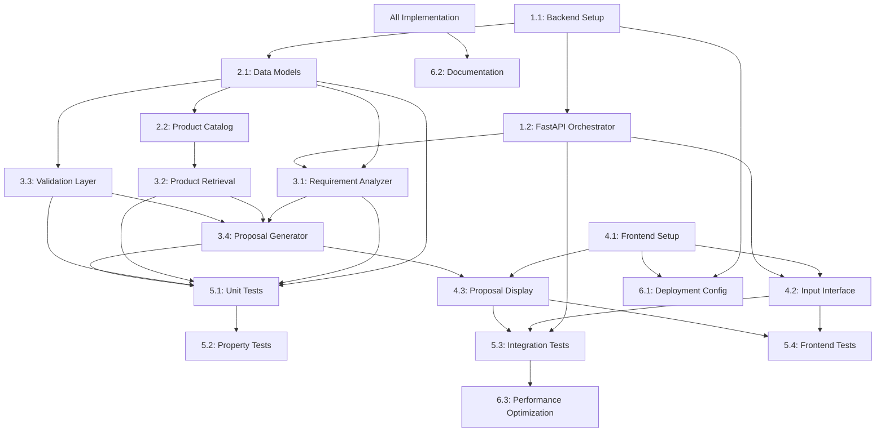

# Tasks Document: autose-platform

## Overview

This document outlines the implementation tasks for the AutoSE Platform based on the design and requirements. Tasks are organized by component and priority to facilitate systematic development.

## Task Categories

### Category 1: Backend Core Infrastructure
### Category 2: Data Models and Validation
### Category 3: Agent Components
### Category 4: Frontend Interface
### Category 5: Testing and Quality Assurance
### Category 6: Deployment and Documentation

## Task List

### Task 1.1: Set up Python Backend Project Structure
**ID**: T1.1  
**Category**: Backend Core Infrastructure  
**Priority**: High  
**Estimated Effort**: 2 hours  
**Dependencies**: None  
**Description**: Create basic FastAPI project structure with proper module organization.  
**Acceptance Criteria**:
- Project uses Python 3.8+
- FastAPI framework installed
- Proper module structure: `src/autose_platform/` with submodules
- Basic `main.py` with FastAPI app instance
- `requirements.txt` or `pyproject.toml` with dependencies
- `.env` template for configuration

**Implementation Steps**:
1. Create project directory structure
2. Initialize virtual environment
3. Install FastAPI and dependencies
4. Create basic app structure
5. Set up configuration management

### Task 1.2: Implement FastAPI Backend Orchestrator
**ID**: T1.2  
**Category**: Backend Core Infrastructure  
**Priority**: High  
**Estimated Effort**: 3 hours  
**Dependencies**: T1.1  
**Description**: Implement the main FastAPI backend that orchestrates the multi-agent pipeline.  
**Acceptance Criteria**:
- `FastAPIBackend` class implemented as per design
- POST `/analyze` endpoint with proper request/response models
- Async support for LLM API calls
- Error handling with appropriate HTTP status codes
- Pipeline sequence: extraction → matching → validation → generation

**Implementation Steps**:
1. Create `FastAPIBackend` class with component initialization
2. Implement `analyze_requirement` async method
3. Create Pydantic models for request/response
4. Implement FastAPI route with error handling
5. Add async support for LLM integration

### Task 2.1: Implement Data Models with Pydantic
**ID**: T2.1  
**Category**: Data Models and Validation  
**Priority**: High  
**Estimated Effort**: 2 hours  
**Dependencies**: T1.1  
**Description**: Implement all data models defined in the design with Pydantic validation.  
**Acceptance Criteria**:
- `StructuredRequirements` model with field validation
- `Product` model with all catalog attributes
- `ValidationResult` model with check statuses
- `Proposal` model with markdown and JSON fields
- All models include example schemas
- Proper field constraints and validation rules

**Implementation Steps**:
1. Create `models.py` module
2. Implement each Pydantic model with field definitions
3. Add validation methods and constraints
4. Include example schemas for documentation
5. Test model instantiation and validation

### Task 2.2: Implement Product Catalog
**ID**: T2.2  
**Category**: Data Models and Validation  
**Priority**: High  
**Estimated Effort**: 1 hour  
**Dependencies**: T2.1  
**Description**: Implement the hardcoded product catalog with exactly 5 products as specified.  
**Acceptance Criteria**:
- Catalog contains exactly 5 products with correct attributes
- Products: AI Server X1, AI Server X2, Edge Node, UPS 5000W, Switch 48P
- All attributes match specification (power, GPU count, price, etc.)
- `can_support_cameras()` method implemented
- Catalog is easily maintainable and testable

**Implementation Steps**:
1. Create product catalog constant or factory function
2. Define all 5 products with exact specifications
3. Implement `can_support_cameras()` method
4. Add helper methods for product filtering
5. Create tests for catalog completeness

### Task 3.1: Implement Requirement Analyzer Agent
**ID**: T3.1  
**Category**: Agent Components  
**Priority**: High  
**Estimated Effort**: 4 hours  
**Dependencies**: T1.2, T2.1  
**Description**: Implement Agent 1 that extracts structured fields from natural language using DeepSeek V3.2.  
**Acceptance Criteria**:
- `RequirementAnalyzer` class implemented as per design
- Integration with DeepSeek V3.2 API
- Extraction of 4 fields: device_count, gpu_required, estimated_power_w, network_ports
- Proper prompt engineering for structured extraction
- Error handling for extraction failures
- Validation of extracted values

**Implementation Steps**:
1. Create `requirement_analyzer.py` module
2. Implement API integration with DeepSeek V3.2
3. Design extraction prompt with structured output schema
4. Implement parsing of LLM response
5. Add validation and error handling
6. Create fallback extraction for simple cases

### Task 3.2: Implement Product Retrieval Agent
**ID**: T3.2  
**Category**: Agent Components  
**Priority**: High  
**Estimated Effort**: 2 hours  
**Dependencies**: T2.1, T2.2  
**Description**: Implement Agent 2 that matches requirements against the product catalog.  
**Acceptance Criteria**:
- `ProductRetriever` class implemented as per design
- Loads hardcoded product catalog
- Matches products based on camera capacity requirements
- Filters based on GPU and network requirements
- Sorts by camera capacity (descending) then price (ascending)
- Returns empty list when no matches found

**Implementation Steps**:
1. Create `product_retriever.py` module
2. Implement catalog loading
3. Create matching algorithm with filtering logic
4. Implement sorting by relevance
5. Add edge case handling (no matches, exact matches)
6. Create comprehensive test cases

### Task 3.3: Implement Validation Layer
**ID**: T3.3  
**Category**: Agent Components  
**Priority**: High  
**Estimated Effort**: 2 hours  
**Dependencies**: T2.1, T2.2  
**Description**: Implement deterministic validation of product compatibility (not LLM-based).  
**Acceptance Criteria**:
- `ValidationLayer` class implemented as per design
- Power validation against 5000W threshold
- Network port requirement validation
- GPU requirement validation
- Returns `ValidationResult` with PASS/FAIL/WARNING statuses
- Includes specific warning messages
- `is_valid()` method implemented

**Implementation Steps**:
1. Create `validation_layer.py` module
2. Implement power calculation and validation
3. Add network port validation logic
4. Implement GPU requirement checking
5. Create `ValidationResult` generation
6. Add comprehensive validation tests

### Task 3.4: Implement Proposal Generator
**ID**: T3.4  
**Category**: Agent Components  
**Priority**: High  
**Estimated Effort**: 3 hours  
**Dependencies**: T2.1, T3.1, T3.2, T3.3  
**Description**: Implement proposal generation with explainable reasoning in markdown and JSON formats.  
**Acceptance Criteria**:
- `ProposalGenerator` class implemented as per design
- Generates markdown-formatted proposal
- Creates JSON structure with detailed reasoning
- Explains product recommendations and rejections
- Includes risk analysis for validation warnings
- Provides optimization suggestions
- Includes timestamp in ISO format

**Implementation Steps**:
1. Create `proposal_generator.py` module
2. Implement markdown template system
3. Create JSON reasoning structure builder
4. Add explanation generation for recommendations
5. Implement risk analysis for validation results
6. Add optimization suggestion logic
7. Create comprehensive proposal tests

### Task 4.1: Set up Frontend Project Structure
**ID**: T4.1  
**Category**: Frontend Interface  
**Priority**: Medium  
**Estimated Effort**: 2 hours  
**Dependencies**: None  
**Description**: Set up React or Streamlit frontend project structure based on choice.  
**Acceptance Criteria**:
- Project uses React (TypeScript) or Streamlit (Python)
- Proper component structure and organization
- Build configuration (webpack/vite for React)
- Dependency management (package.json or requirements.txt)
- Basic routing and layout structure

**Implementation Steps**:
1. Choose frontend technology (React recommended)
2. Initialize project with proper tooling
3. Set up component structure
4. Configure build and development tools
5. Set up API integration foundation

### Task 4.2: Implement Requirement Input Interface
**ID**: T4.2  
**Category**: Frontend Interface  
**Priority**: Medium  
**Estimated Effort**: 3 hours  
**Dependencies**: T4.1, T1.2  
**Description**: Implement chat-style interface for requirement input and submission.  
**Acceptance Criteria**:
- Text input field for requirement description
- Submit button to initiate analysis
- Loading indicator during processing
- Input history preservation
- Error message display
- Responsive design for different screen sizes

**Implementation Steps**:
1. Create input component with text area
2. Implement submit button with API integration
3. Add loading state management
4. Create history storage and display
5. Implement error handling and display
6. Add responsive styling

### Task 4.3: Implement Proposal Display Interface
**ID**: T4.3  
**Category**: Frontend Interface  
**Priority**: Medium  
**Estimated Effort**: 3 hours  
**Dependencies**: T4.1, T3.4  
**Description**: Implement interface to display generated proposals with markdown rendering.  
**Acceptance Criteria**:
- Markdown rendering for proposal content
- JSON reasoning display (collapsible/expandable)
- Validation warning highlighting
- Optimization suggestions display
- Clean, readable formatting
- Copy-to-clipboard functionality

**Implementation Steps**:
1. Integrate markdown rendering library
2. Create proposal display component
3. Implement JSON viewer for reasoning
4. Add warning highlighting and display
5. Create optimization suggestions panel
6. Add copy functionality and formatting

### Task 5.1: Implement Unit Test Suite
**ID**: T5.1  
**Category**: Testing and Quality Assurance  
**Priority**: Medium  
**Estimated Effort**: 4 hours  
**Dependencies**: T2.1, T3.1, T3.2, T3.3, T3.4  
**Description**: Create comprehensive unit tests for all backend components.  
**Acceptance Criteria**:
- pytest test suite structure
- Tests for all data models and validation
- Tests for requirement extraction (mocked LLM)
- Tests for product matching algorithms
- Tests for validation logic
- Tests for proposal generation
- 90%+ code coverage for core business logic

**Implementation Steps**:
1. Set up pytest configuration
2. Create test fixtures and helpers
3. Implement model validation tests
4. Create mocked LLM tests for extraction
5. Implement product matching tests
6. Create validation logic tests
7. Implement proposal generation tests
8. Measure and ensure coverage targets

### Task 5.2: Implement Property-Based Tests
**ID**: T5.2  
**Category**: Testing and Quality Assurance  
**Priority**: Low  
**Estimated Effort**: 3 hours  
**Dependencies**: T5.1  
**Description**: Implement property-based tests using Hypothesis for key algorithms.  
**Acceptance Criteria**:
- Hypothesis property tests for requirement extraction
- Property tests for product matching monotonicity
- Property tests for validation consistency
- Property tests for proposal generation
- Test data generation for edge cases
- Comprehensive property coverage

**Implementation Steps**:
1. Set up Hypothesis configuration
2. Create generators for test data
3. Implement extraction property tests
4. Create matching algorithm property tests
5. Implement validation property tests
6. Create proposal generation property tests
7. Run property tests with various strategies

### Task 5.3: Implement Integration Tests
**ID**: T5.3  
**Category**: Testing and Quality Assurance  
**Priority**: Medium  
**Estimated Effort**: 3 hours  
**Dependencies**: T1.2, T4.2, T4.3  
**Description**: Create integration tests for the full pipeline and API endpoints.  
**Acceptance Criteria**:
- API endpoint integration tests
- Full pipeline integration tests
- Frontend-backend integration tests
- Mock LLM responses for testing
- Performance testing for response times
- Error scenario integration tests

**Implementation Steps**:
1. Create API test client setup
2. Implement endpoint integration tests
3. Create full pipeline integration tests
4. Set up frontend-backend integration tests
5. Implement performance measurement tests
6. Create error scenario integration tests

### Task 5.4: Implement Frontend Tests
**ID**: T5.4  
**Category**: Testing and Quality Assurance  
**Priority**: Low  
**Estimated Effort**: 3 hours  
**Dependencies**: T4.2, T4.3  
**Description**: Create tests for frontend components and interactions.  
**Acceptance Criteria**:
- React component tests (if using React)
- User interaction tests
- API integration tests
- Error handling tests
- Responsive design tests
- Cross-browser compatibility tests

**Implementation Steps**:
1. Set up Jest/React Testing Library
2. Create component unit tests
3. Implement user interaction tests
4. Create API integration tests
5. Implement error handling tests
6. Add responsive design tests

### Task 6.1: Create Deployment Configuration
**ID**: T6.1  
**Category**: Deployment and Documentation  
**Priority**: Low  
**Estimated Effort**: 2 hours  
**Dependencies**: T1.1, T4.1  
**Description**: Create deployment configuration for both backend and frontend.  
**Acceptance Criteria**:
- Docker configuration for backend
- Docker configuration for frontend (if applicable)
- Environment variable configuration
- Deployment scripts or instructions
- Production vs development configuration
- Health check endpoints

**Implementation Steps**:
1. Create Dockerfile for FastAPI backend
2. Create Dockerfile for React frontend (if applicable)
3. Set up docker-compose for local development
4. Create environment configuration
5. Implement health check endpoints
6. Create deployment documentation

### Task 6.2: Create Comprehensive Documentation
**ID**: T6.2  
**Category**: Deployment and Documentation  
**Priority**: Low  
**Estimated Effort**: 3 hours  
**Dependencies**: All implementation tasks  
**Description**: Create comprehensive documentation for the AutoSE platform.  
**Acceptance Criteria**:
- API documentation with OpenAPI/Swagger
- User guide for requirement input
- Developer guide for extending the platform
- Architecture documentation
- Deployment guide
- Troubleshooting guide

**Implementation Steps**:
1. Generate OpenAPI documentation from FastAPI
2. Create user guide with examples
3. Write developer guide for extension
4. Document architecture decisions
5. Create deployment instructions
6. Write troubleshooting guide

### Task 6.3: Implement Performance Optimization
**ID**: T6.3  
**Category**: Deployment and Documentation  
**Priority**: Low  
**Estimated Effort**: 2 hours  
**Dependencies**: T5.3  
**Description**: Implement performance optimizations based on testing results.  
**Acceptance Criteria**:
- LLM response caching implemented
- Product matching optimization
- Validation pre-computation
- Proposal template caching
- Memory usage optimization
- Response time improvements

**Implementation Steps**:
1. Implement LLM response caching
2. Optimize product matching algorithms
3. Pre-compute common validation scenarios
4. Cache proposal templates
5. Optimize memory usage
6. Measure and verify performance improvements

## Task Dependencies Graph

## Task Prioritization

### Phase 1: Core MVP (Week 1)
**Priority**: Critical path for minimum viable product
- T1.1: Backend Setup (2h)
- T1.2: FastAPI Orchestrator (3h)
- T2.1: Data Models (2h)
- T2.2: Product Catalog (1h)
- T3.1: Requirement Analyzer (4h)
- T3.2: Product Retrieval (2h)
- T3.3: Validation Layer (2h)
- T3.4: Proposal Generator (3h)
- T5.1: Unit Tests (4h)

**Total Phase 1**: 23 hours

### Phase 2: Frontend & Integration (Week 2)
**Priority**: User interface and system integration
- T4.1: Frontend Setup (2h)
- T4.2: Input Interface (3h)
- T4.3: Proposal Display (3h)
- T5.3: Integration Tests (3h)

**Total Phase 2**: 11 hours

### Phase 3: Enhancement & Deployment (Week 3)
**Priority**: Quality improvements and deployment
- T5.2: Property Tests (3h)
- T5.4: Frontend Tests (3h)
- T6.1: Deployment Config (2h)
- T6.2: Documentation (3h)
- T6.3: Performance Optimization (2h)

**Total Phase 3**: 13 hours

**Total Estimated Effort**: 47 hours

## Risk Mitigation Tasks

### Risk Mitigation 1: LLM Fallback Implementation
**Risk**: DeepSeek V3.2 API unavailable or rate limited
**Mitigation Task**: Implement fallback extraction using regex patterns for simple cases
**Effort**: 2 hours
**Priority**: Medium
**Dependencies**: T3.1

### Risk Mitigation 2: Catalog Extension Mechanism
**Risk**: Hardcoded catalog insufficient for all requirements
**Mitigation Task**: Create catalog extension mechanism with configuration files
**Effort**: 3 hours
**Priority**: Low
**Dependencies**: T2.2

### Risk Mitigation 3: Performance Monitoring
**Risk**: System performance degrades under load
**Mitigation Task**: Implement performance monitoring and alerting
**Effort**: 2 hours
**Priority**: Low
**Dependencies**: T6.3

## Success Criteria

### Technical Success Criteria
1. All acceptance criteria from requirements met
2. 90%+ test coverage for core business logic
3. Performance targets met (6s end-to-end, 100 concurrent users)
4. Zero critical security vulnerabilities
5. Comprehensive documentation available

### Business Success Criteria
1. System processes example workflow successfully
2. Generated proposals include explainable reasoning
3. Validation warnings are clear and actionable
4. User interface is intuitive and responsive
5. System can be extended with new products or validation rules

## Task Tracking

| Task ID | Task Name | Status | Assigned To | Start Date | End Date | Notes |
|---------|-----------|--------|-------------|------------|----------|-------|
| T1.1 | Backend Setup | Pending | | | | |
| T1.2 | FastAPI Orchestrator | Pending | | | | |
| T2.1 | Data Models | Pending | | | | |
| T2.2 | Product Catalog | Pending | | | | |
| T3.1 | Requirement Analyzer | Pending | | | | |
| T3.2 | Product Retrieval | Pending | | | | |
| T3.3 | Validation Layer | Pending | | | | |
| T3.4 | Proposal Generator | Pending | | | | |
| T4.1 | Frontend Setup | Pending | | | | |
| T4.2 | Input Interface | Pending | | | | |
| T4.3 | Proposal Display | Pending | | | | |
| T5.1 | Unit Tests | Pending | | | | |
| T5.2 | Property Tests | Pending | | | | |
| T5.3 | Integration Tests | Pending | | | | |
| T5.4 | Frontend Tests | Pending | | | | |
| T6.1 | Deployment Config | Pending | | | | |
| T6.2 | Documentation | Pending | | | | |
| T6.3 | Performance Optimization | Pending | | | | |

## Notes

1. **Technology Choices**: React recommended over Streamlit for better scalability and maintainability
2. **LLM Integration**: DeepSeek V3.2 API requires proper authentication and rate limiting
3. **Testing Strategy**: Focus on property-based testing for algorithmic correctness
4. **Deployment**: Consider containerization for easy deployment across environments
5. **Monitoring**: Implement logging and monitoring from the start for production readiness